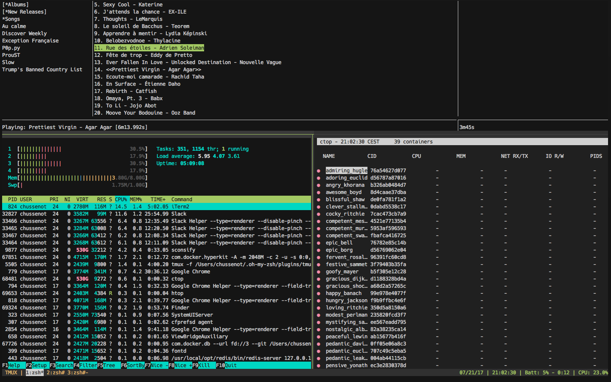

# My .dotfiles

Config files for ZSH, Ruby, Go, Terminals and more.

## Screenshots



## Dependencies

- make (optional)

## Install

Run this:

```console
git clone https://github.com/chussenot/.dotfiles.git ~/.dotfiles
cd ~/.dotfiles
make bootstrap
chsh -s $(which zsh)
```

This will symlink the appropriate files in `.dotfiles` to your home directory.
Everything is configured and tweaked within `~/.dotfiles`.

## Hierarchy

There's a few special files in the hierarchy.

- **bin/**: Anything in `bin/` will get added to your `$PATH` and be made
  available everywhere.
- **Brewfile**: This is a list of applications for
  Homebrew Cask to install: things like Chrome and
  Spotify and Atom and stuff. Might want to edit this file before running
  any initial setup.
- **topic/\*.zsh**: Any files ending in `.zsh` get loaded into your
  environment.
- **topic/path.zsh**: Any file named `path.zsh` is loaded first and is
  expected to setup `$PATH` or similar.
- **topic/completion.zsh**: Any file named `completion.zsh` is loaded
  last and is expected to setup autocomplete.
- **topic/\*.symlink**: Any files ending in `*.symlink` get symlinked into
  your `$HOME`. This is so you can keep all of those versioned in your dotfiles
  but still keep those autoloaded files in your home directory. These get
  symlinked in when you run `script/bootstrap`.
- **topic/install.sh**: Any file with this name and with exec permission, will
ran at bootstrap phase.

## Add custom commands without creating a new fork

If ``~/.localrc`` exists, it will be sourced along with the other files. You can use this to add a few custom commands without the need to fork this entire repository, or to add commands you don’t want to commit to a public repository.

My ``~/.localrc`` looks something like this:

    # Git credentials
    git config --global user.name "Clement Hussenot"
    git config --global user.email "chussenot@gmail.com"

    # Go environment
    export GOROOT=/usr/local/go
    export GOPATH=$HOME/Projects/gocode
    export PATH=$PATH:$GOROOT/bin:$GOPATH/bin

You can overwrite something using ``~/.localrc``. For example:

    alias p="cd ~/Documents/Projects"

    # Overwrite environment variable
    export EDITOR="neovim"

Or you can extend all your dotfiles configuration using ``~/.localrc`` like entry point. Your ``~/.localrc`` can be like this:

    for file in ~/.extra/.zsh/{local-exports,local-aliases,local-work-settings}.zsh; do
        [ -r "$file" ] && source "$file"
    done
    unset file

And in ``~/.extra/.zsh/local-exports.zsh``, ``~/.extra/.zsh/local-aliases.zsh``, ``~/.extra/.zsh/local-work-settings.zsh`` you can add your own custom commands.

